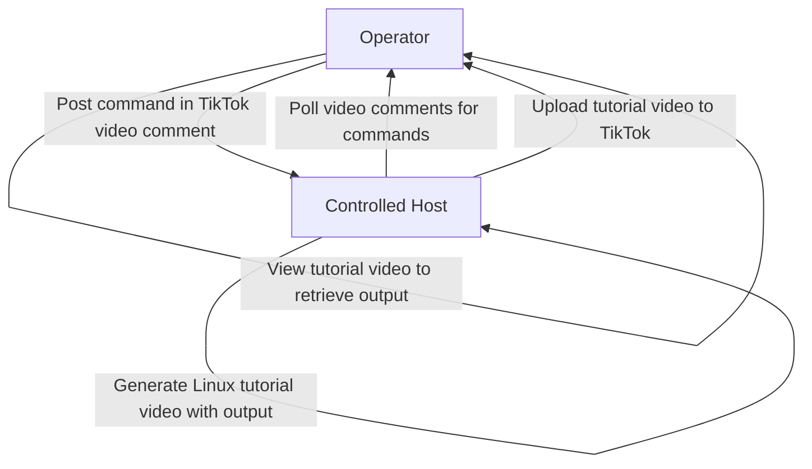

# TikC2 - TikTok Command & Control (C2)

TikC2 is a proof-of-concept Command & Control (C2) framework that leverages TikTok as a covert communication channel. Operators issue Linux commands via comments on TikTok videos, and the controlled system responds by generating Linux tutorial videos that embed command outputs. This approach avoids traditional network callbacks, using TikTok for stealthy C2 operations.

## ⚡ Overview
TikC2 transforms TikTok into a C2 platform:

- **Command Channel**: Operators post Linux commands in comments on specific TikTok videos.
- **Execution**: Commands are executed securely on the target system.
- **Response Channel**: Outputs are embedded in narrated Linux tutorial videos and uploaded to TikTok.
- **Stealth**: Communication occurs entirely through TikTok, eliminating direct server interactions.


## **Demos**:  
- [Demo 1](https://www.tiktok.com/@shiky124/video/7544339462046764295)  
- [Demo 2](https://www.tiktok.com/@shiky124/video/7544340320679447816)

- **Demos video**:
  
https://github.com/user-attachments/assets/a49209de-cde1-462c-b78d-40987e8bf476

## 🔑 Features

### TikTok-Based C2
- Polls comments on designated TikTok videos for commands.
- Exfiltrates command outputs via Linux tutorial video uploads.

### Secure Command Execution
- Runs Linux commands in a sandboxed environment.
- Captures stdout for integration into tutorial videos.

### Dynamic Video Generation
- Terminal-style typing animations for realism.
- Structured tutorial slides: Title → Command Explanation → Output → Summary.

### Authentication
- Uses TikTok cookies (`cookies.json`) for seamless access.

### Failsafe
- Halts the C2 loop upon receiving a `stop_me` comment.

## 📦 Installation

### Prerequisites
- **Python**: 3.8+
- **Browser**: Google Chrome (for Playwright automation)
- **OS**: Linux (required for man pages)
- **Hardware**: Adequate CPU/RAM for video processing

### Dependencies
Install required packages:
```bash
pip install -r requirements.txt
```

Key libraries:
- `playwright>=1.45.0`: TikTok web automation
- `moviepy>=1.0.3`: Video editing and rendering
- `pyttsx3` or `gtts`: Text-to-speech narration
- `typing-extensions>=4.12.0`: Type support

### Setup
1. **Install Playwright Browser Runtime**:
   ```bash
   playwright install chromium
   ```

2. **Export TikTok Cookies**:
   - Install the [Get-cookies.txt-LOCALLY](https://github.com/kairi003/Get-cookies.txt-LOCALLY) extension (Chrome/Firefox).
   - Log in to TikTok in your browser.
   - Export cookies for `https://www.tiktok.com` using the extension.
   - Save as `cookie3.txt` in the project root.

3. **Convert Cookies to JSON**:
   ```bash
   python convert_cookie.py
   ```
   Generates `cookies.json` for authentication.

## 📂 Project Structure
```
tikc2/
├── tikc2.py              # Main C2 controller
├── convert_cookie.py     # Converts Netscape cookies to JSON
├── requirements.txt      # Python dependencies
├── cookies.json          # TikTok authentication cookies
├── cookie3.txt           # Raw Netscape cookie export
└── output/               # Generated tutorial videos
```

## 🚀 Quick Start
1. **Clone the repository**:
   ```bash
   git clone https://github.com/shiky8/tikc2.git
   cd tikc2
   ```

2. **Install dependencies**:
   ```bash
   pip install -r requirements.txt
   playwright install chromium
   ```

3. **Set up TikTok cookies** (see Installation).

4. **Run the C2 loop**:
   ```bash
   python tikc2.py
   ```

The script uploads a "heartbeat" video, polls video comments for commands, and responds with tutorial videos until a `stop_me` comment is received.

## 🛠 Usage

### Running the C2 Loop
```bash
python tikc2.py
```

**Flow**:
- Uploads a "heartbeat" video (runs `id` command).
- Polls comments on the designated TikTok video for new commands.
- Executes received commands and captures output.
- Generates a Linux tutorial video embedding the command output and narration.
- Uploads the tutorial video to TikTok.
- Stops on `stop_me` comment.

### Manual Video Creation
Generate a tutorial video for a specific command:
```python
from tikc2 import make_video, build_enhanced_narration, run_command_capture_output

cmd = "ls"
output = run_command_capture_output(cmd)
narration = build_enhanced_narration(cmd, output)
make_video(cmd, output, narration, "ls_tutorial.mp4")
```

## 🛰 How It Works

### C2 Loop
1. **Tasking**: Operator posts a Linux command in a comment on a designated TikTok video.
2. **Polling**: Controlled host retrieves comments from the video.
3. **Execution**: Command runs in a sandboxed Linux environment.
4. **Exfiltration**: Output is embedded in a narrated Linux tutorial video.
5. **Delivery**: Tutorial video is uploaded to TikTok for operator review.

### Video Features
- **Terminal Animation**: Realistic typing effect mimicking a Linux terminal.
- **Tutorial Slide Structure**:
  - **Title**: Introduces the command.
  - **Explanation**: Describes the command's purpose (e.g., using man page info).
  - **Output**: Displays captured stdout.
  - **Summary**: Recaps the command's results.
- **Specs**: 1280×720, 24 FPS, H.264 video, AAC audio.

## 📊 C2 Flow Diagram


## ⚠️ Limitations
- **Cookie Expiry**: TikTok cookies require periodic renewal.
- **Linux Dependency**: `man` pages require a Linux environment.
- **Resource Usage**: Video generation is CPU/RAM-intensive.
- **Comment Retrieval Latency**: Dependent on TikTok API response times.
- **Upload Latency**: Depends on TikTok upload speeds.

## 🛠 Troubleshooting
- **Cookie Errors**: Verify `cookie3.txt` is correctly exported and converted to `cookies.json`.
- **Playwright Issues**: Ensure Chromium is installed (`playwright install chromium`).
- **Video Failures**: Check for sufficient disk space and RAM.
- **Command Failures**: Ensure commands are valid for the Linux environment.
- **Comment Polling Issues**: Confirm the correct video ID is monitored and TikTok API is accessible.

## 🛡 Disclaimer
TikC2 is a research tool for exploring social media-based C2 techniques. It is intended for educational and research purposes only. Unauthorized use, including malicious access or disruption, is prohibited. The authors are not liable for misuse.

## 📌 Contributing
We welcome contributions to improve TikC2. Ideas include:
- Support for additional covert channels (e.g., other platforms).
- Enhanced video obfuscation for stealth.
- Cross-platform support (Windows, macOS).
- Improved command parsing and validation.

**To Contribute**:
1. Fork the repository.
2. Create a feature branch (`git checkout -b shiky8/tikc2`).
3. Submit a pull request with detailed changes.

## 📬 Contact
For questions or issues, open a GitHub issue or contact the maintainers.
